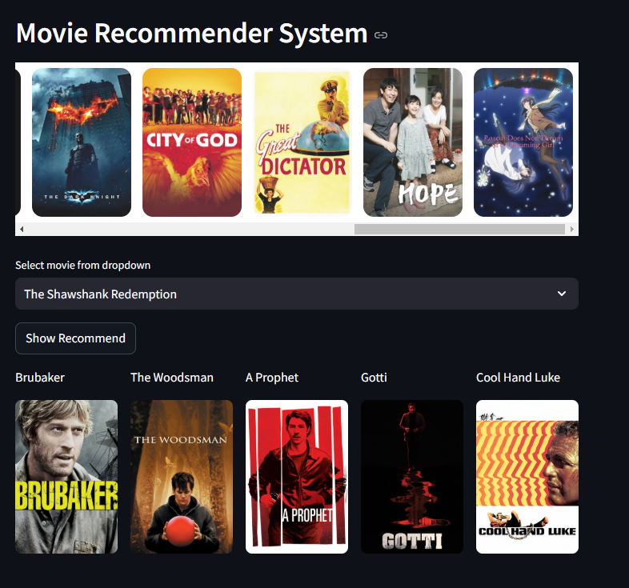

# 🎬 Movie Recommender System  

      

## 📌 About the Project  
This is a  <a href="https://developers.google.com/machine-learning/recommendation/content-based/basics">**content-based movie recommendation system**</a> that suggests similar movies based on the input movie title.  
The system uses **TF-IDF (<a href="https://en.wikipedia.org/wiki/Tf%E2%80%93idf">Term Frequency-Inverse Document Frequency</a>) vectorization** to process movie descriptions and then applies **cosine similarity** to determine how similar movies are to each other.  

### 🔍 Role of Cosine Similarity  
Cosine similarity is used to measure the **angle** between two feature vectors in a high-dimensional space.  
A higher cosine similarity score means two movies have more similar content based on their descriptions.  

The formula for cosine similarity between two vectors **A** and **B** is given by:

$$
\text{cosine similarity} = \frac{\mathbf{A} \cdot \mathbf{B}}{\|\mathbf{A}\| \|\mathbf{B}\|}
$$

where
- $\mathbf{A} \cdot \mathbf{B}$ is the <a href="https://en.wikipedia.org/wiki/Dot_product">**dot product**</a> of the vectors.
- $\|\mathbf{A}\|$ and $\|\mathbf{B}\|$ are the <a href="https://en.wikipedia.org/wiki/Magnitude_(mathematics)">**magnitudes**</a> (Euclidean norms) of the vectors.


### 🖼️ Visuals  
Below is a screenshot of the web interface of the application:  

  

## 🚀 How to run it on your own machine 
1. Clone this repository:  
   ```bash
   git clone https://github.com/your-repo/movie-recommender.git  
   cd movie-recommender  
2. Navigate to the correct directory and install the requirements
   ```
   $ pip install -r requirements.txt
   ```

3. Run the app

   ```
   $ streamlit run streamlit_app.py
   ``` 
4. Open the displayed ```localhost``` URL in your browser.


## 🛠 <u>Tech Stack</u>
<ol>
   <li>Python - for data processing and machine learning</li>
   <li>Streamlit - for building web application</li>
   <li>Scikit-learn - for machine learning models</li>
   <li>Pandas - for data manipulation</li>
   <li>Request - for fetching movie posters from <a href="https://www.themoviedb.org/movie">TMDB website</a>.</li>

</ol>


## 📚 <u>Lessons Learned and Exposures</u>
<ol>
   <li>Understood how cosine similarity works in recommendation sysrtems</li>
   <li>NLP techniques such as TF-IDF vectorizations</li>
</ol>